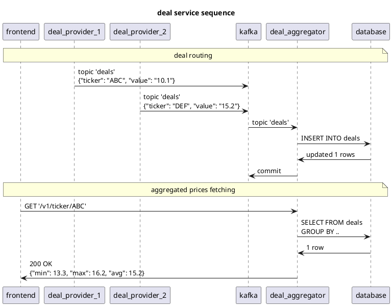

```plantuml 
@startuml

title deal service sequence

note across
    deal routing
end note

participant frontend
participant deal_provider_1
participant deal_provider_2
participant kafka
participant deal_aggregator
participant database

deal_provider_1 -> kafka : topic 'deals'\n{"ticker": "ABC", "value": "10.1"}
deal_provider_2 -> kafka : topic 'deals'\n{"ticker": "DEF", "value": "15.2"}
kafka -> deal_aggregator : topic 'deals'
deal_aggregator -> database: INSERT INTO deals
database -> deal_aggregator : updated 1 rows
deal_aggregator -> kafka: commit

note across
    aggregated prices fetching
end note

frontend -> deal_aggregator : GET '/v1/ticker/ABC'
deal_aggregator -> database : SELECT FROM deals\nGROUP BY ..
database -> deal_aggregator : 1 row
deal_aggregator -> frontend : 200 OK\n{"min": 13.3, "max": 16.2, "avg": 15.2}
@enduml

```